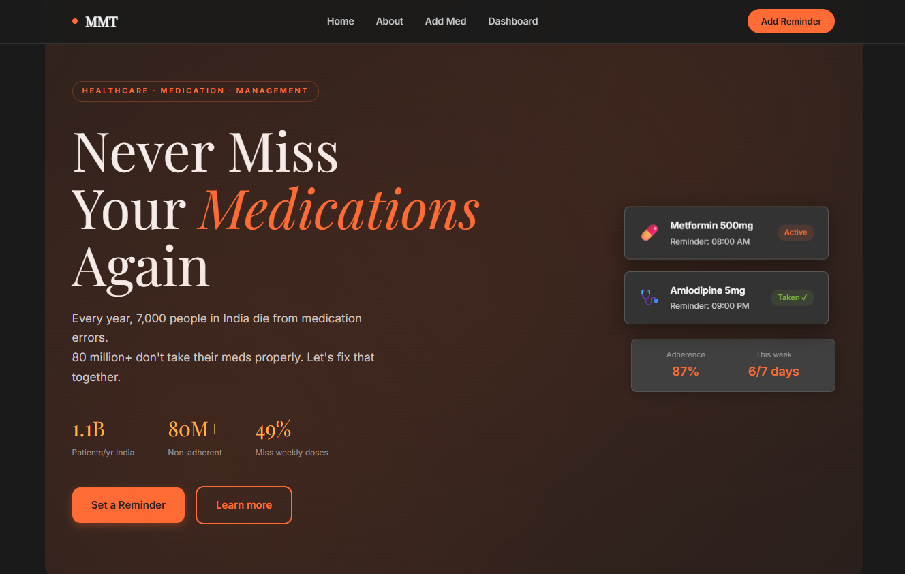
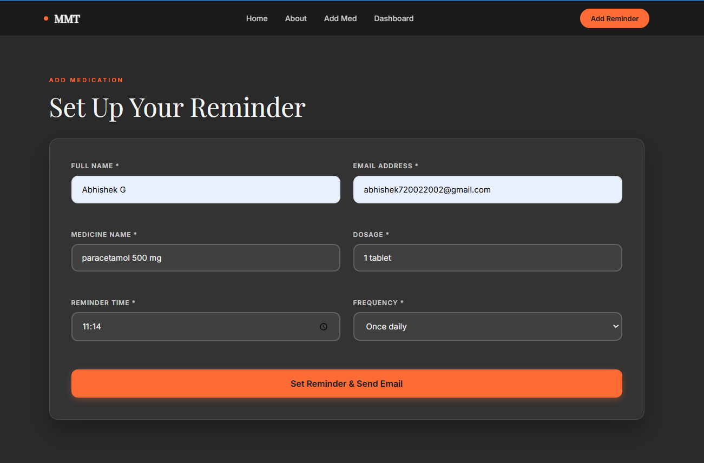
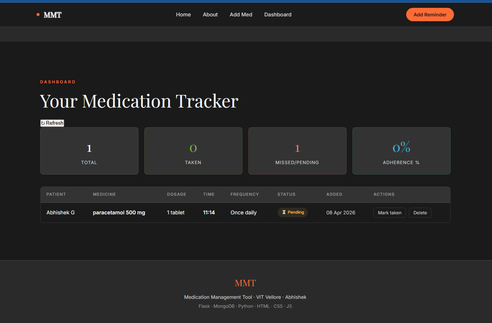
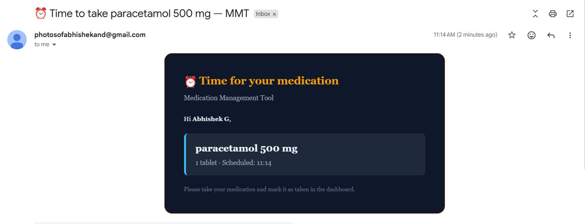

# 💊 Medication Management Tool (MMT)

[](https://python.org)
[](https://flask.palletsprojects.com)
[](https://mongodb.com)
[](https://apscheduler.readthedocs.io)
[](LICENSE)

> A full-stack medication reminder web app that tackles the **80M+ non-adherent patients** problem in India — scheduling automated email reminders via Gmail SMTP and tracking adherence in real time through a dark-theme dashboard.

**Research Paper**: VIT Vellore — Abhishek G

---

## 📌 Table of Contents
- [Overview](#-overview)
- [Demo](#-demo)
- [Architecture](#-architecture)
- [Features](#-features)
- [Project Structure](#-project-structure)
- [Quickstart](#-quickstart)
- [API Reference](#-api-reference)
- [How Reminders Work](#-how-reminders-work)
- [Tech Stack](#-tech-stack)

---

## 🔍 Overview

Non-adherence to medication is one of the most costly and preventable health problems — patients forget, miss doses, and face preventable deterioration. MMT automates the reminder loop:

- **Add** a medication with name, dosage, time, and frequency
- **Receive** an instant confirmation email with all details
- **Get reminded** automatically at the scheduled time every day
- **Track** your adherence rate live on the dashboard

---

## 🖼 Demo

### Hero Landing Page

> Animated gradient background with orb effects — entry point for the app

### Add Medication Form

> Modal form — captures patient name, email, medicine, dosage, time, and frequency

### Tracker Dashboard

> Dashboard — tracking patient details, medications, dosage, schedule, and adherence frequency.

### Email Reminder


> Styled HTML email sent at the scheduled time with medicine name and dosage details

---

## 🏗 Architecture

```
Browser (HTML + Vanilla JS)
        │  fetch() / REST
        ▼
┌──────────────────────────────┐
│   Flask App  (app.py)        │
│  ┌──────────┐ ┌───────────┐  │
│  │  Routes  │ │ Scheduler │  │  ← APScheduler polls every 1 min
│  └────┬─────┘ └─────┬─────┘  │
│       │             │         │
│  ┌────▼─────────────▼──────┐  │
│  │   Flask-Mail (SMTP)     │  │  ← Confirmation + Reminder emails
│  └─────────────────────────┘  │
└──────────────┬───────────────┘
               │  PyMongo
               ▼
       MongoDB (medications)
```

---

## ✨ Features

| Feature | Description |
|---------|-------------|
| 📋 **Medication CRUD** | Add, view, mark taken, delete medications |
| ✅ **Confirmation Email** | HTML email sent instantly on add |
| ⏰ **Auto Reminders** | APScheduler checks every minute, fires if `time == now` and `taken == False` |
| 📊 **Adherence Stats** | Live API returns total / taken / missed / adherence % |
| 🌑 **Dark Dashboard** | Responsive dark-theme UI with card layout |
| 🚀 **Hero Landing** | Animated gradient + orb entry page at `/hero` |
| 🔒 **Error Handling** | Graceful 503 responses on DB failure, email try/catch |

---

## 📁 Project Structure

```
MMT/
├── app.py                   ← Flask backend — routes, email, scheduler
├── run.py                   ← Entry point
├── requirements.txt
├── .env                     ← Credentials (not committed)
├── templates/
│   ├── index.html           ← Main dashboard UI
│   └── hero-landing.html    ← Animated landing page
└── static/
    ├── css/style.css        ← Dark-theme styles (26 KB)
    └── js/script.js         ← Fetch calls, DOM updates
```

---

## ⚡ Quickstart

### 1. Clone & install

```bash
git clone https://github.com/yourusername/medication-management-tool.git
cd medication-management-tool
pip install -r requirements.txt
```

### 2. Configure `.env`

```env
MONGO_URI=mongodb://localhost:27017/mmt_db
MAIL_USER=your_gmail@gmail.com
MAIL_PASS=your_16_char_app_password
```

> **Gmail App Password** (required — NOT your login password):  
> `Gmail → Settings → Security → 2-Step Verification → App Passwords → Generate`

### 3. Start MongoDB

```bash
# Local
mongod

# Or use MongoDB Atlas free cluster — paste the connection string URI in .env
```

### 4. Run

```bash
python run.py
```

Open → **http://localhost:5000** (dashboard) · **http://localhost:5000/hero** (landing)

---

## 🔌 API Reference

| Method | Endpoint | Description |
|--------|----------|-------------|
| `GET` | `/api/medications` | List all medications |
| `POST` | `/api/medications` | Add new medication + send confirmation email |
| `PATCH` | `/api/medications/<medicine>/taken` | Mark as taken |
| `DELETE` | `/api/medications/<medicine>` | Delete record |
| `GET` | `/api/stats` | Adherence stats (total / taken / missed / rate) |

**POST body example:**
```json
{
  "name": "Abhishek",
  "email": "user@gmail.com",
  "medicine": "Metformin",
  "dosage": "500mg",
  "time": "08:00",
  "frequency": "Daily"
}
```

**Stats response:**
```json
{ "total": 5, "taken": 4, "missed": 1, "adherence": 80.0 }
```

---

## 📬 How Reminders Work

```
User adds medication
       │
       ▼
Instant confirmation email ✅  (Flask-Mail → Gmail SMTP)
       │
       ▼
APScheduler fires every 60 seconds
       │
       ├── time == HH:MM now?
       │       └── YES → taken == False?
       │                   └── YES → Send reminder email ⏰
       │                   └── NO  → Skip (already taken)
       └── NO  → Skip
       │
       ▼
User clicks "Mark Taken" on dashboard
       └── PATCH /api/medications/<n>/taken → taken = True → no more reminders
```

---

## 🛠 Tech Stack

| Layer | Technology |
|-------|-----------|
| Frontend | HTML5 · CSS3 · Vanilla JS |
| Backend | Python 3.10 · Flask 3.0 |
| Database | MongoDB (PyMongo) |
| Email | Flask-Mail · Gmail SMTP (TLS 587) |
| Scheduler | APScheduler 3.10 (BackgroundScheduler) |
| Config | python-dotenv |
| Testing | Postman |

---

## 🔮 Future Work

- [ ] SMS reminders via Twilio
- [ ] Multi-user auth (JWT / Flask-Login)
- [ ] Caregiver dashboard with family medication tracking
- [ ] Mobile PWA for push notifications
- [ ] Adherence analytics with weekly/monthly trend charts
- [ ] Deploy to Railway / Render with MongoDB Atlas

---

## 👤 Author

**Abhishek**  
M.Sc. Computational Statistics & Data Analytics — VIT Vellore  
School of Advanced Sciences

Built with ❤️ using Flask · MongoDB · APScheduler · Gmail SMTP
