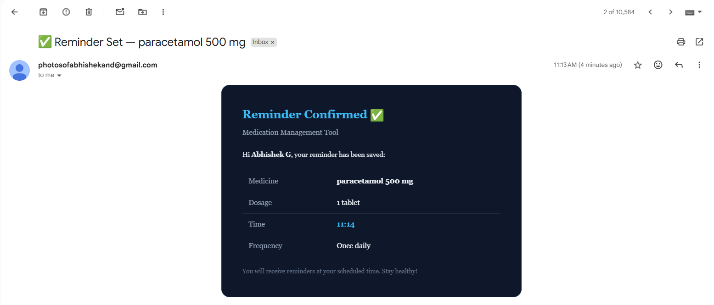

<div align="center">

<!-- ✅ ANIMATED 3D PILL BANNER — self-hosted SVG -->


<br/>

<!-- ✅ ANIMATED TYPING SVG -->


<br/><br/>

<!-- BADGES ROW 1 -->


<br/>

<!-- BADGES ROW 2 -->


<br/><br/>

</div>

---

## 💊 What is MMT?

> **Medication Management Tool** is a full-stack health web application that tackles the **80M+ non-adherent patients** problem in India — automating the reminder loop through intelligent scheduling, Gmail SMTP delivery, and a real-time dark-theme adherence dashboard.

Non-adherence to medication is one of the most **costly and preventable health crises**. Patients forget, skip doses, and face deterioration that was entirely avoidable. MMT closes this gap:

- **Add** a medication with name, dosage, time, and frequency
- **Receive** an instant HTML confirmation email with all details
- **Get reminded** automatically at the scheduled time, every day
- **Track** live adherence rates on a responsive dark dashboard

---

## 🎯 Problem → Solution

```
  BEFORE MMT                                    AFTER MMT
──────────────────────────────────────        ──────────────────────────────────────
Patient forgets dose → no fallback     →     Auto email reminder fires at exact time
Manual reminders (WhatsApp, calls)     →     Zero-touch SMTP scheduling via Gmail
No visibility into adherence           →     Live API → taken / missed / rate %
Reactive care after deterioration      →     Proactive reminders prevent missed doses
No unified dashboard                   →     Realtime dark-theme tracker per patient
```

---

## 📸 Dashboard Preview

<div align="center">

**🏠 Hero Landing Page**
> Animated gradient background with orb effects — entry point at `/hero`


<br/>

**📋 Add Medication Modal**
> Captures patient name, email, medicine, dosage, time, and frequency


<br/>

**📊 Adherence Tracker Dashboard**
> Live card layout — tracks patient details, medications, dosage, schedule, adherence %


<br/>

**📬 HTML Email Reminder**
> Styled email sent at scheduled time with medicine name, dosage, and instructions




</div>

---

## 🏗️ Architecture

```
Browser (HTML + Vanilla JS)
         │  fetch() / REST
         ▼
┌─────────────────────────────────┐
│   Flask App  (app.py)           │
│  ┌───────────┐  ┌─────────────┐ │
│  │  Routes   │  │  Scheduler  │ │  ← APScheduler polls every 60s
│  └─────┬─────┘  └──────┬──────┘ │
│        │               │        │
│  ┌─────▼───────────────▼──────┐ │
│  │    Flask-Mail (SMTP)       │ │  ← Confirmation + Reminder emails
│  └────────────────────────────┘ │
└──────────────┬──────────────────┘
               │  PyMongo
               ▼
       MongoDB (medications)
```

---

## ✨ Features

| Feature | Description |
|---------|-------------|
| 📋 **Medication CRUD** | Add, view, mark taken, delete medications via REST API |
| ✅ **Confirmation Email** | Styled HTML email sent instantly on medication add |
| ⏰ **Auto Reminders** | APScheduler checks every 60s, fires if `time == now` and `taken == False` |
| 📊 **Adherence Stats** | Live `/api/stats` → total / taken / missed / adherence % |
| 🌑 **Dark Dashboard** | Responsive dark-theme UI with card layout at `/` |
| 🚀 **Hero Landing** | Animated gradient + orb entry page at `/hero` |
| 🔒 **Error Handling** | Graceful 503 on DB failure, email try/catch with logging |

---

## 📁 Project Structure

```
MMT/
├── app.py                   ← Flask backend — routes, email logic, scheduler
├── run.py                   ← App entry point
├── requirements.txt
├── .env                     ← Credentials (not committed)
├── templates/
│   ├── index.html           ← Main dashboard UI
│   └── hero-landing.html    ← Animated landing page
└── static/
    ├── css/style.css        ← Dark-theme styles (26 KB)
    └── js/script.js         ← Fetch calls, DOM updates
```

---

## ⚡ Quickstart

### 1. Clone & Install

```bash
git clone https://github.com/yourusername/medication-management-tool.git
cd medication-management-tool
pip install -r requirements.txt
```

### 2. Configure `.env`

```env
MONGO_URI=mongodb://localhost:27017/mmt_db
MAIL_USER=your_gmail@gmail.com
MAIL_PASS=your_16_char_app_password
```

> **Gmail App Password** (required — NOT your login password):
> `Gmail → Settings → Security → 2-Step Verification → App Passwords → Generate`

### 3. Start MongoDB

```bash
# Local
mongod

# Or MongoDB Atlas — paste the connection string URI into .env
```

### 4. Run

```bash
python run.py
```

Open → **http://localhost:5000** (dashboard) · **http://localhost:5000/hero** (landing)

---

## 🔌 API Reference

| Method | Endpoint | Description |
|--------|----------|-------------|
| `GET` | `/api/medications` | List all medications |
| `POST` | `/api/medications` | Add new medication + send confirmation email |
| `PATCH` | `/api/medications/<medicine>/taken` | Mark medication as taken |
| `DELETE` | `/api/medications/<medicine>` | Delete a medication record |
| `GET` | `/api/stats` | Adherence stats — total / taken / missed / rate |

**POST body example:**
```json
{
  "name": "Abhishek",
  "email": "user@gmail.com",
  "medicine": "Metformin",
  "dosage": "500mg",
  "time": "08:00",
  "frequency": "Daily"
}
```

**Stats response:**
```json
{ "total": 5, "taken": 4, "missed": 1, "adherence": 80.0 }
```

---

## 📬 How Reminders Work

```
User adds medication
        │
        ▼
Instant confirmation email ✅   (Flask-Mail → Gmail SMTP)
        │
        ▼
APScheduler fires every 60 seconds
        │
        ├── time == HH:MM now?
        │        └── YES → taken == False?
        │                    └── YES → Send reminder email ⏰
        │                    └── NO  → Skip (already marked taken)
        └── NO  → Skip
        │
        ▼
User clicks "Mark Taken" on dashboard
        └── PATCH /api/medications/<n>/taken → taken = True → no more reminders today
```

---

## 🛠️ Tech Stack

<div align="center">

| Layer | Technology | Role |
|-------|-----------|------|
| **Frontend** | HTML5 · CSS3 · Vanilla JS | Dark-theme responsive dashboard |
| **Backend** | Python 3.10 · Flask 3.0 | REST API + email logic |
| **Database** | MongoDB · PyMongo | Medication persistence |
| **Email** | Flask-Mail · Gmail SMTP (TLS 587) | Confirmation + reminder delivery |
| **Scheduler** | APScheduler 3.10 BackgroundScheduler | Minute-by-minute reminder trigger |
| **Config** | python-dotenv | Secure credential management |
| **Testing** | Postman | API endpoint validation |

</div>

---

## 🌍 Real-World Impact

```
💊  80M+ patients in India face medication non-adherence
📉  Non-adherence causes 125,000+ preventable deaths annually (US alone)
💸  Costs healthcare systems $300B+ globally per year
⏱️  MMT fires reminders at the exact scheduled minute — zero delay
🎯  Instant email confirmation means patients trust the system from dose 1
✅  Mark-as-taken flow closes the loop — no double reminders
```

---

## 🔮 Future Work

- 📱 SMS reminders via Twilio
- 🔐 Multi-user auth (JWT / Flask-Login)
- 👨‍👩‍👧 Caregiver dashboard with family medication tracking
- 📲 Mobile PWA for push notifications
- 📈 Adherence analytics with weekly / monthly trend charts
- ☁️ Deploy to Railway / Render with MongoDB Atlas

---

## 👤 Author

<div align="center">

**Abhishek**
M.Sc. Computational Statistics & Data Analytics — VIT Vellore
School of Advanced Sciences

*Built using Flask · MongoDB · APScheduler · Gmail SMTP*

</div>

---

<div align="center">


<p>
  <sub>Built to fight medication non-adherence · <strong>MMT</strong> · Automated care, one reminder at a time</sub>
</p>

<p>
  
  
  
</p>

</div>
